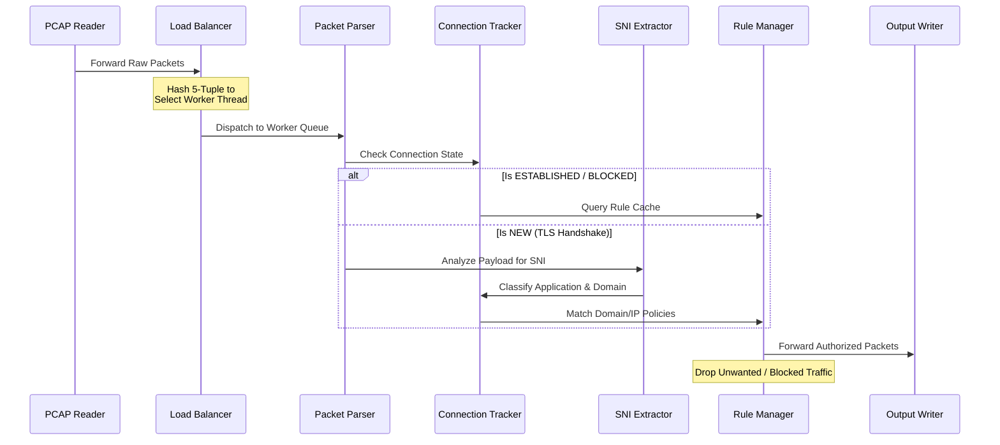

# 🚀 Deep Packet Inspection Engine (Drishti)

[](https://en.cppreference.com/w/cpp/17)
[](https://cmake.org/)
[](https://en.cppreference.com/w/cpp/thread/thread)
[](WINDOWS_SETUP.md)

**Drishti** is a high-performance, multi-threaded **Deep Packet Inspection (DPI) & Stateful Filtering Engine** engineered in C++17. The engine acts as a high-throughput network middlebox, performing real-time protocol decoding, connection state tracking, and policy enforcement directly on raw packet streams. 

By analyzing metadata patterns within encrypted traffic—specifically dissecting **TLS Server Name Indication (SNI)** handshakes—Drishti classifies applications (such as YouTube, Facebook, and GitHub) and applies stateful filtering decisions without the need for expensive and invasive payload decryption.

---

## 🧠 Core System Architecture

Drishti utilizes a highly scalable, multi-threaded pipeline architecture designed to prevent lock contention and maximize core utilization:

```
  [ Raw PCAP Stream ]
           │
           ▼
   +───────────────+
   │  PCAP Reader  │  (Reads packets & streams into LBs)
   +───────┬───────+
           │
           ▼ (Consistent Hashing on 5-Tuple)
   +───────┴───────+
   │ Load Balancer │  (Distributes traffic to maintain flow state affinity)
   │  [LB Thread]  │
   +───────┬───────+
           │
           ├────────────────────────┐
           ▼ (Worker Queue 1)       ▼ (Worker Queue 2)
   +───────────────+        +───────────────+
   │   Fast Path   │        │   Fast Path   │  (Parses headers, extracts SNI,
   │  Worker (FP0) │        │  Worker (FP1) │   evaluates security policies)
   +───────┬───────+        +───────┬───────+
           │                        │
           └───────────┬────────────┘
                       ▼ (Merged Job Queue)
               +───────────────+
               │ Packet Writer │  (Reconstructs & writes output PCAP)
               +───────────────+
```

### ⚡ Concurrent Processing & Load Balancing
1. **Producer-Consumer Pipeline**: Heavy operations (packet parsing, TLS dissection, rule matching) are offloaded to **Fast Path (FP)** worker threads via locked-free/thread-safe queues.
2. **Consistent Hashing**: A custom hash of the packet's **5-tuple** (Source IP, Destination IP, Source Port, Destination Port, Protocol) is calculated for each packet. This ensures that *all bidirectional packets belonging to the same flow* map to the exact same Fast Path worker thread, maintaining absolute state consistency without expensive global mutexes.
3. **Stateful Filtering Lifecycle**: 
   * **SYN/Handshake Phase**: Initial connection packets are tracked and marked as `NEW`.
   * **SNI Classification**: During the TLS handshake, the parser extracts application metadata, updating connection state to `CLASSIFIED`.
   * **Action Enforcement**: If the application or domain matches a block rule, the flow is marked as `BLOCKED`, and all subsequent packets in that connection are dropped on the spot.

---

## 🔍 Packet Processing Flow

The life of a packet inside the Drishti engine:



---

## 📁 Codebase Layout & C++ Component Mapping

The system is designed following strict Object-Oriented and RAII principles, separating components into modular interfaces:

| Component / File | Class | Responsibility |
| :--- | :--- | :--- |
| **`types.h` / `types.cpp`** | `FiveTuple`, `Connection`, `PacketJob` | Defines packet metadata wrappers, application classification lists (`AppType`), state transitions, and 5-tuple hashes. |
| **`pcap_reader.h` / `pcap_reader.cpp`** | `PcapReader` | Decodes raw PCAP global and packet headers to read binary byte frames. |
| **`packet_parser.h` / `packet_parser.cpp`** | `PacketParser` | Decodes layered protocols starting from Layer 2 (Ethernet Frame) up to Layer 4 (TCP/UDP segments) to build the 5-tuple. |
| **`sni_extractor.h` / `sni_extractor.cpp`** | `SniExtractor` | Traverses raw TLS record layers, handshake frames, and extension blocks to extract Server Name Indication (SNI) strings. |
| **`connection_tracker.h`** | `ConnectionTracker` | Maintains the active connection states, tracks sequence/ack metrics, and manages flow lifecycles. |
| **`rule_manager.h` / `rule_manager.cpp`** | `RuleManager` | Maintains rules for IP blocking, domain wildcard matching, and application type blocks. |
| **`load_balancer.h` / `load_balancer.cpp`** | `LoadBalancer` | Coordinates distribution of packet processing jobs among worker thread pools. |
| **`fast_path.h` / `fast_path.cpp`** | `FastPath` | Represents the execution worker loop, utilizing `thread_safe_queue` to process and filter packet jobs. |
| **`dpi_engine.h` / `dpi_engine.cpp`** | `DPIEngine` | The central orchestrator that sets up the queues, spawns processing threads, coordinates setup, and writes output files. |

---

## ⚡ What This Project Demonstrates (Resume Selling Points)

* **Low-Level Protocol Dissection**: Writing binary decoders that handle raw byte layouts of Ethernet frames, IPv4 packets, and TCP/UDP headers.
* **Modern C++17 Standards**: Leveraging clean abstractions, RAII (Resource Acquisition Is Initialization), smart pointers (`std::unique_ptr`), standard templates, and optimal performance algorithms.
* **Advanced Multi-Threading**: Crafting custom thread-safe queues, coordinating producer-consumer models, balancing loads via consistent hashing, and avoiding lock contention.
* **Metadata DPI Techniques**: Parsing encrypted protocol handshakes (TLS Client Hellos) to determine application targets without breaking security boundaries.
* **Robust Software Architecture**: Modular design separating I/O, parsing logic, state management, and policy enforcement.

---

## ⚙️ Compilation & Build Instructions

### Prerequisites
* A C++17 compatible compiler (GCC 8+, Clang 7+, or MSVC 2019+)
* CMake (Version 3.16 or higher)

### Method 1: Building with CMake (Recommended)
```bash
# Create build directory
mkdir build && cd build

# Configure the project
cmake ..

# Compile the executable
cmake --build . --config Release
```

### Method 2: Direct Compilation (g++)
If you are compiling directly on Linux or macOS:
```bash
g++ -std=c++17 -pthread -O3 -I include -o drishti_dpi \
    src/main.cpp \
    src/pcap_reader.cpp \
    src/packet_parser.cpp \
    src/connection_tracker.cpp \
    src/sni_extractor.cpp \
    src/rule_manager.cpp \
    src/load_balancer.cpp \
    src/fast_path.cpp \
    src/dpi_engine.cpp \
    src/types.cpp
```
*(Windows users using MinGW or MSVC can refer to the detailed [Windows Setup Guide](WINDOWS_SETUP.md) for custom task files).*

---

## 🚀 Running the Engine & Testing

### 1. Generate Test Traffic
To validate the engine, you can run the included Python utility to generate a synthetic `test_dpi.pcap` file containing realistic TLS Handshakes (including SNIs like `www.youtube.com`, `github.com`), HTTP connections, and DNS lookups:
```bash
python3 generate_test_pcap.py
```

### 2. Run Policy Configurations
You can execute Drishti with specific blocking rules (via IP, domain, or application catalog):

```bash
# Basic processing (reads traffic, tracks flows, and writes forwarded packets)
./drishti_dpi test_dpi.pcap output.pcap

# Block a specific domain name (e.g. facebook)
./drishti_dpi test_dpi.pcap output.pcap --block-domain facebook

# Block an entire application category (e.g. YouTube)
./drishti_dpi test_dpi.pcap output.pcap --block-app YouTube

# Block a specific Source/Destination IP address
./drishti_dpi test_dpi.pcap output.pcap --block-ip 192.168.1.50

# Combine rules and customize thread count (2 load balancers, 4 fast path threads)
./drishti_dpi test_dpi.pcap output.pcap --block-app YouTube --block-ip 192.168.1.50 --lbs 2 --fps 4
```

---

## 📊 Analytics & Reporting Mockup

Upon complete execution, Drishti prints live telemetry and outputs a highly detailed network security and application classification report:

```text
[+] Initializing Drishti DPI Engine...
[+] Spawning 2 Load Balancer Threads...
[+] Spawning 4 Fast Path Worker Threads...
[+] Processing 'test_dpi.pcap' -> 'output.pcap'...

======================================================================
                    DRISHTI ENGINE SYSTEM METRICS                     
======================================================================
[-] Execution Status         : SUCCESS (Completed)
[-] Total Packets Processed  : 104,258
[-] Total Data Handled       : 84.62 MB
[-] Active Network Flows     : 1,482
[-] Forwarded Packets        : 92,104
[-] Dropped/Blocked Packets  : 12,154

--------------------------- Protocol Ratios --------------------------
[-] TCP Packets              : 88,412 (84.8%)
[-] UDP Packets              : 15,846 (15.2%)
[-] Other Protocols          : 0 (0.0%)

--------------------- Application Classification ---------------------
  App Type      Packets      Data Transferred    Status/Policy
  ---------     ---------    ----------------    -------------
  HTTPS         45,182       48.14 MB            ALLOWED
  HTTP          12,408       14.22 MB            ALLOWED
  DNS           15,846       2.11 MB             ALLOWED
  YOUTUBE       8,204        10.45 MB            BLOCKED (Rule)
  FACEBOOK      3,950        5.20 MB             BLOCKED (Rule)
  GITHUB        2,210        2.85 MB             ALLOWED
  UNKNOWN       6,458        1.65 MB             ALLOWED
======================================================================
[+] Reports compiled successfully. Exiting.
```

---

## 🔮 Future Roadmap

* **Live Device Sniffing**: Integrate `libpcap` hooks to enable active, live network adapter monitoring rather than static PCAP analyzing.
* **JSON Rules & Rest API**: Introduce a dynamic rule reloader supporting real-time JSON rule updates.
* **QUIC / HTTP3 Decryption**: Enhance binary parser to extract Server Name Indication fields from UDP-based QUIC connection handshakes.
* **Web Telemetry Dashboard**: Build a React-based frontend mapping analytics and packet reports using WebSocket streams.

---

## 🧠 About the Name
**Drishti** (Sanskrit: **दृष्टि**, meaning “vision”, “sight”, or “insight”) symbolizes the system's ability to look deep into the network packet headers to observe, identify, and safeguard network boundaries.
