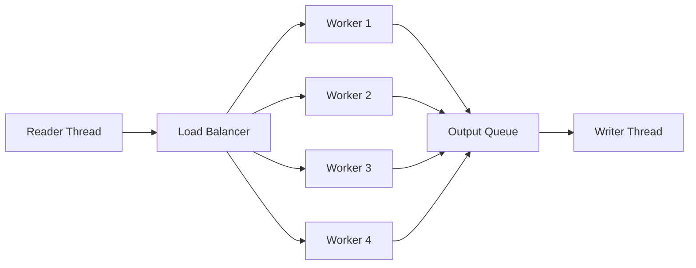
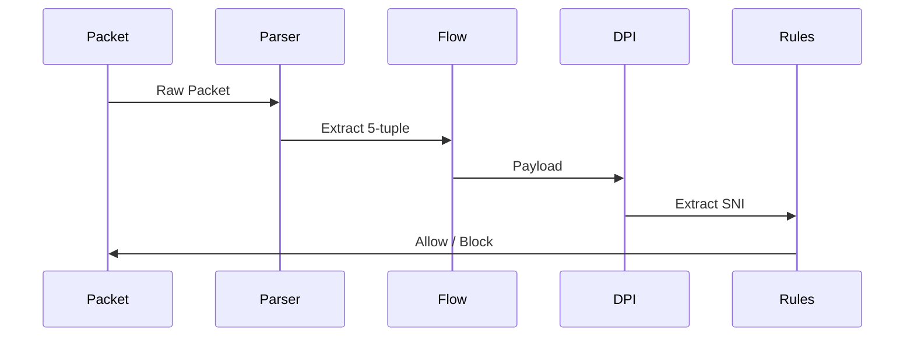

# 🚀 Netra – Deep Packet Inspection Engine


---

## 🧠 Overview

**Netra** is a high-performance **Deep Packet Inspection (DPI) engine** built in C++ that analyzes network traffic at the packet level, identifies applications using TLS metadata, and enforces flow-based filtering policies.

Even though modern internet traffic is encrypted, critical metadata still exists during connection setup. Netra leverages this to inspect traffic **without decrypting payloads**, making it efficient and practical for real-world scenarios.

---

## ⚙️ Key Features

* 🔍 **Packet Parsing** – Extracts Ethernet, IP, TCP/UDP headers from raw data
* 🌐 **Application Identification** – Uses TLS SNI to detect services like YouTube, Facebook
* 🔁 **Flow Tracking** – Maintains connection state using 5-tuple
* 🚫 **Rule Engine** – Blocks traffic by IP, domain, or application
* ⚡ **Multi-threaded Processing** – High-throughput pipeline architecture
* 📊 **Traffic Analytics** – Generates detailed reports and statistics

---

## 🏗️ System Architecture

        +-------------------+
        |   PCAP Input      |
        +-------------------+
                  ↓
        +-------------------+
        | Packet Parser     |
        +-------------------+
                  ↓
        +-------------------+
        | Flow Manager      |
        |   (5-Tuple)       |
        +-------------------+
                  ↓
        +-------------------+
        | SNI Extractor     |
        |   (TLS)           |
        +-------------------+
                  ↓
        +-------------------+
        | Rule Engine       |
        +-------------------+
            ↓          ↓
        Forward      Drop

---

## 🔑 Core Concepts

### 1. Flow-Based Processing

Each network connection is identified using a **5-tuple**:

* Source IP
* Destination IP
* Source Port
* Destination Port
* Protocol

All packets belonging to the same flow share state and are processed consistently.

---

### 2. Deep Packet Inspection via SNI

Although HTTPS encrypts payloads, the **Server Name Indication (SNI)** is visible during the TLS handshake.

```
Client Hello → SNI: www.youtube.com
```

Netra extracts this value to:

* Identify the application
* Apply filtering decisions

---

### 3. Stateful Filtering

Filtering decisions are made at the **flow level**:

* Initial packets → allowed (no SNI yet)
* TLS handshake → identify application
* If blocked → mark flow
* All subsequent packets → dropped

---

## ⚡ Multi-threaded Architecture



### Key Design Ideas:

* **Consistent Hashing** → Same flow handled by same thread
* **Thread-safe Queues** → Efficient producer-consumer pattern
* **Parallel Workers** → Scalable packet processing

---

## 🔍 Packet Processing Flow



---

## 📁 Project Structure

```
netra-dpi-engine/
├── include/        # Header files
├── src/            # Core implementation
├── test/           # Sample PCAP files
└── README.md
```

---

## 🚀 Build & Run

### 🔧 Build

```bash
g++ -std=c++17 -O2 -I include -o netra src/*.cpp
```

### ▶️ Run

```bash
./netra input.pcap output.pcap --block-app YouTube
```

### ⚙️ Example Rules

```bash
--block-app YouTube
--block-domain facebook
--block-ip 192.168.1.50
```

---

## 📊 Output

Netra generates:

* Total packets processed
* Forwarded vs dropped packets
* Application-wise traffic distribution
* Detected domains (SNI)

---

## 🔒 Rule Engine

Supported filtering:

| Type        | Description                        |
| ----------- | ---------------------------------- |
| IP          | Block traffic from specific source |
| Domain      | Match SNI strings                  |
| Application | Block known services               |

---

## 🎯 What This Project Demonstrates

* Network protocol parsing (Ethernet, IP, TCP)
* TLS handshake analysis
* Flow-based system design
* Multi-threaded architecture
* High-performance data processing

---

## 🚀 Future Enhancements

* Real-time packet capture (libpcap)
* Web-based monitoring dashboard
* Dynamic rule configuration (JSON)
* AI-based anomaly detection
* QUIC / HTTP3 support

---

## 🧠 About the Name

**Netra** (Sanskrit: “vision”) represents the system’s ability to observe and analyze network traffic at a deep level.

---

## ⭐ Summary

Netra is a systems-level project that demonstrates how modern network inspection and filtering systems operate internally—combining networking, concurrency, and performance-oriented design.
